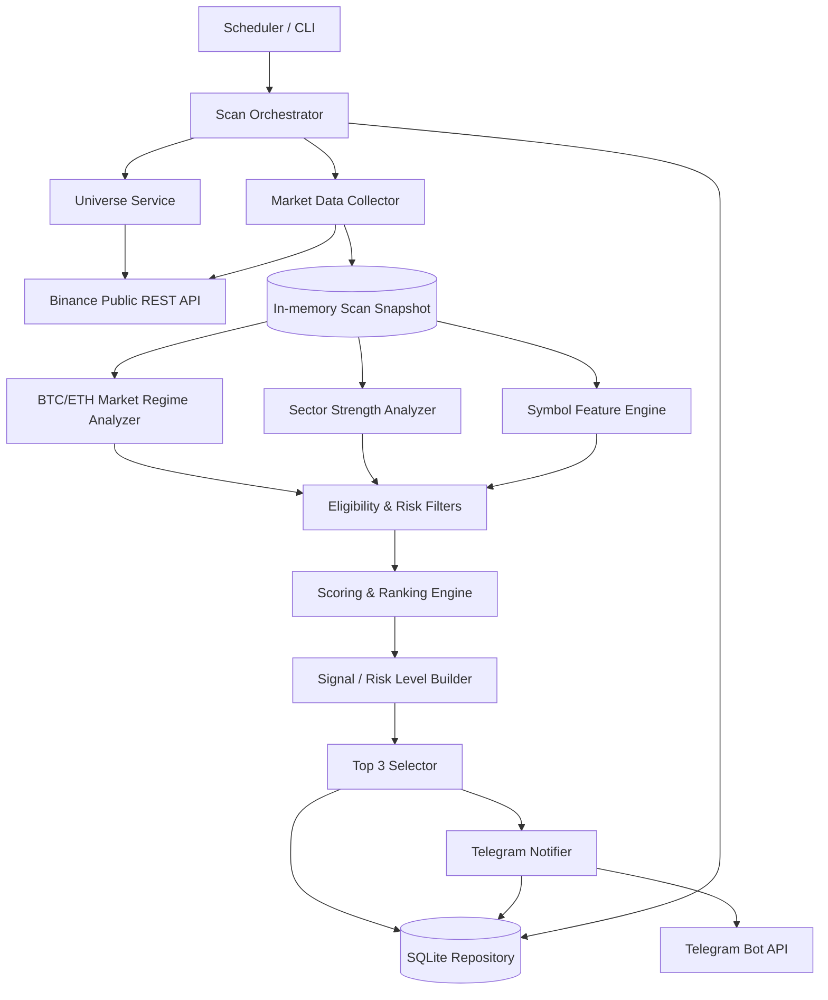
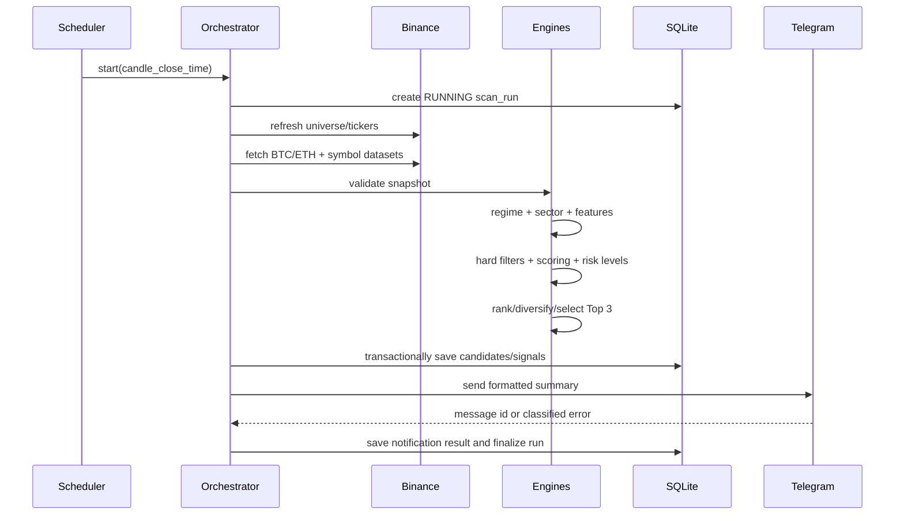

# Binance AI Trader V1 — 总体架构设计

> 文档状态：Draft（第一阶段实施基线）
> 更新日期：2026-06-05
> 产品性质：市场扫描、量化评分与信号通知系统；**不连接交易账户，不执行实盘或模拟下单**。

## 1. 仓库现状与结论

### 1.1 当前结构

```text
Chatgpt-bian/
└── .gitkeep    # 0 字节占位文件
```

当前 Git 分支为 `work`，仓库只有一次初始化提交。未发现：

- 应用源代码；
- 依赖清单或锁文件；
- 环境变量模板；
- 数据库 schema / migration；
- 自动化测试；
- 容器、部署或 CI 配置；
- 产品和技术文档；
- 仓库内 `AGENTS.md` 约束。

### 1.2 是否为空

仓库在 Git 意义上不是完全空仓库，因为存在已跟踪的 `.gitkeep`；但在产品与工程意义上是空仓库，没有任何可运行功能或可复用模块。因此 V1 可按绿地项目设计，不需要兼容既有技术栈。

## 2. 产品范围

### 2.1 第一阶段目标

系统按固定周期扫描 Binance 上可交易的 USDT 本位永续合约，结合 BTC/ETH 大盘环境、板块强弱、单标的趋势/动量/量能/流动性和风险收益结构进行确定性评分，筛选并输出最多 3 个信号：

```json
{
  "symbol": "SOLUSDT",
  "direction": "LONG",
  "entry": 145.20,
  "stop_loss": 141.80,
  "stop_loss_pct": 2.34,
  "TP1": 150.30,
  "TP2": 155.40,
  "RR": 2.0,
  "logic_summary": "大盘偏多；L1 板块领先；4h/1h 趋势同向；成交量扩张。"
}
```

V1 仅包括：

1. 公共行情数据采集；
2. 市场状态识别；
3. 板块强弱识别；
4. 候选标的评分；
5. Top 3 信号生成；
6. Telegram 推送；
7. SQLite 历史信号与运行审计存储。

### 2.2 明确不做

- 不接入 Binance API Key、交易账户或用户资产；
- 不创建、修改或取消任何订单；
- 不提供自动跟单；
- 不使用杠杆、仓位管理、账户级风险预算；
- 不在 V1 中训练机器学习模型或让 LLM 决定交易信号；
- 不承诺收益率、命中率或“稳赚”；
- 不把历史回测结果等同于未来表现。

“AI Trader”在 V1 中是产品名称；核心决策必须由可解释、可回放、可测试的规则和评分系统产生。未来可以加入机器学习作为独立特征源，但不能绕过风险过滤和审计记录。

## 3. 架构原则

1. **只读市场接入**：第一阶段仅调用公开市场数据接口，从结构上杜绝下单。
2. **确定性**：相同配置与同一份快照应生成相同结果。
3. **先过滤、后评分**：剔除不可交易、低流动性、数据缺失和异常标的，再排序。
4. **时间一致性**：默认只使用已收盘 K 线；所有数据使用 UTC，并记录数据时间戳。
5. **可解释**：总分由分项分数构成，每个信号保留评分明细和生成逻辑。
6. **可回放**：保存扫描批次、配置版本、核心特征、信号和推送结果。
7. **故障隔离**：单个 symbol 失败不能导致整批扫描失败；通知失败不能丢失信号。
8. **渐进演进**：V1 使用模块化单体与 SQLite，避免过早引入微服务、消息队列和复杂基础设施。

## 4. 推荐技术基线

由于仓库为空，建议采用以下低运维成本方案：

| 领域 | 建议 | 原因 |
|---|---|---|
| 语言 | Python 3.12+ | 数据处理生态成熟，适合指标计算、定时任务和快速验证 |
| 包管理 | `uv` + `pyproject.toml` | 依赖解析快，开发和 CI 命令统一 |
| HTTP | `httpx` | 支持连接池、超时和异步并发 |
| 数据模型 | `pydantic` / `pydantic-settings` | 输入校验、配置校验和清晰的数据契约 |
| 指标计算 | `pandas` + `numpy` | V1 的批量 K 线指标足够，便于审计 |
| 数据库 | SQLite + migration 工具 | 单机零运维，适合 V1 信号历史和运行记录 |
| 调度 | 进程内调度器或 cron 单次命令 | 简单可靠，避免首版引入分布式调度 |
| 重试 | `tenacity` 或等价机制 | 统一处理限流、超时和暂时性错误 |
| 日志 | 标准 `logging` + JSON formatter | 可观测且不绑定云平台 |
| 测试 | `pytest` | 单元、契约和集成测试生态成熟 |
| 质量 | Ruff + Pyright（或 mypy） | 统一格式、静态检查和类型检查 |
| 部署 | Docker 单进程 | 环境可复制，适合 VPS、云主机或 NAS |

版本号在实施时锁定；文档不预先写死第三方库的小版本。

## 5. 逻辑架构



### 5.1 运行方式

V1 推荐“定时批处理”，而不是常驻 WebSocket：

- 每 15 分钟触发一次扫描，且在 15m K 线收盘后预留 30–90 秒；
- 1h、4h 指标只使用已完成 K 线；
- 每日或每 6 小时刷新合约 universe 和板块映射；
- 每个扫描批次生成唯一 `run_id`；
- 批次内部使用有界并发获取数据，确保不突破交易所限流；
- 全批完成后在同一快照语义下统一评分，避免先后请求造成明显时间漂移。

WebSocket 可在后续用于降低延迟，但不是 V1 的必要条件。Top 3 属于周期级信号，REST 批处理更容易保证可重放性和故障恢复。

## 6. 建议目录结构

以下是后续实施目标，不代表当前仓库已经存在这些文件：

```text
.
├── src/binance_ai_trader/
│   ├── __init__.py
│   ├── cli.py
│   ├── config.py
│   ├── domain/
│   │   ├── enums.py
│   │   ├── market.py
│   │   ├── score.py
│   │   └── signal.py
│   ├── application/
│   │   ├── scan_orchestrator.py
│   │   ├── market_regime.py
│   │   ├── sector_strength.py
│   │   ├── feature_engine.py
│   │   ├── scoring.py
│   │   ├── risk_levels.py
│   │   └── top3_selector.py
│   ├── infrastructure/
│   │   ├── binance/
│   │   │   ├── client.py
│   │   │   ├── rate_limit.py
│   │   │   └── mapper.py
│   │   ├── database/
│   │   │   ├── connection.py
│   │   │   ├── repositories.py
│   │   │   └── migrations/
│   │   └── telegram/
│   │       ├── client.py
│   │       └── formatter.py
│   └── observability/
│       ├── logging.py
│       └── metrics.py
├── config/
│   ├── settings.example.yaml
│   └── sectors.yaml
├── tests/
│   ├── unit/
│   ├── integration/
│   ├── contract/
│   └── fixtures/
├── scripts/
├── data/.gitkeep
├── architecture.md
├── roadmap.md
├── pyproject.toml
├── uv.lock
├── .env.example
├── Dockerfile
└── README.md
```

依赖方向必须保持为：`domain <- application <- infrastructure/entrypoints`。领域模型不能直接依赖 HTTP、SQLite 或 Telegram。

## 7. 数据采集设计

### 7.1 Universe 构建

每次刷新合约列表时，仅纳入满足以下条件的标的：

- USDⓈ-M / USDT 本位；
- 永续合约；
- 当前状态允许交易；
- 计价资产为 USDT；
- 有足够历史 K 线用于全部指标预热；
- 未被本地 denylist 排除。

保留交易所提供的价格精度、数量精度、tick size 等元数据。虽然 V1 不下单，价格输出仍应按交易规则进行合法舍入。

### 7.2 数据集

| 数据 | 用途 | 建议刷新频率 |
|---|---|---|
| 合约信息 | universe、状态、精度、过滤器 | 6 小时 |
| 24h ticker | 成交额、涨跌幅、流动性初筛 | 每轮 |
| 15m K 线 | 入场时机、短期动量、ATR | 每轮 |
| 1h K 线 | 主评分周期、趋势与量能 | 每轮 |
| 4h K 线 | 高周期方向与大盘 regime | 每轮或按新 K 线 |
| BTCUSDT/ETHUSDT 数据 | 大盘状态、风险开关 | 每轮 |
| funding rate | 拥挤度惩罚 | 每轮或按更新周期 |
| open interest（若稳定可用） | 价格/OI 共振 | 每轮，允许降级 |

V1 不应抓取逐笔成交或深度全量快照，除非后续验证它们对 15 分钟级信号有稳定增益。

### 7.3 请求策略

- 设置连接、读取和总请求超时；
- 对网络超时、5xx 和明确的限流响应采用指数退避及抖动；
- 不盲目重试业务参数错误；
- 使用全局并发信号量和可配置请求预算；
- 解析响应中的限流信息，并在接近预算时主动降速；
- 缓存相同批次内重复使用的数据；
- 对每个数据对象记录 `source_timestamp` 与 `fetched_at`；
- 校验 K 线连续性、重复、排序、OHLC 合法性及是否已收盘。

### 7.4 数据质量闸门

以下情况不得生成对应标的信号：

- 关键周期 K 线数量不足；
- 最新已收盘 K 线超过容忍的新鲜度；
- 出现时间缺口、重复 K 线或非法价格；
- 成交额低于配置阈值；
- spread 数据可用时超过阈值；
- 合约状态在扫描中发生变化；
- ATR 为零、价格异常或无法构造有效止损。

若 BTC/ETH 大盘数据失效，则整批扫描标记为 `DEGRADED`，默认不发布新信号，而不是在缺失风险背景时继续推送。

## 8. 市场状态分析

### 8.1 BTC 与 ETH Regime

分别在 1h 与 4h 计算：

- EMA20、EMA50、EMA200 排列和斜率；
- 收盘价相对 EMA50/EMA200 的位置；
- 近 N 根收益率；
- ADX 或等价趋势强度；
- ATR 百分比和波动率分位；
- 成交量相对均量；
- 可选的 funding/OI 拥挤度。

单资产状态建议分为：

- `BULL_TREND`：趋势向上且强度达标；
- `BEAR_TREND`：趋势向下且强度达标；
- `RANGE`：趋势不明确；
- `HIGH_VOLATILITY`：波动异常，覆盖普通趋势状态；
- `DATA_INVALID`：数据不足或异常。

综合 BTC/ETH 形成市场门控：

| BTC/ETH 组合 | 多头 | 空头 | 行为 |
|---|---:|---:|---|
| 两者偏多 | 正常 | 提高门槛 | 偏多 regime |
| 两者偏空 | 提高门槛 | 正常 | 偏空 regime |
| 分化或震荡 | 提高门槛 | 提高门槛 | 降低信号数量 |
| 高波动 | 禁止或显著提高门槛 | 禁止或显著提高门槛 | 风险关闭/降级 |
| 数据无效 | 禁止 | 禁止 | 不发布 |

门槛值必须配置化，并在回放/走查后固定为版本化配置。

## 9. 强势板块识别

Binance 合约元数据通常不能直接提供稳定、完整的“板块”语义，因此 V1 采用仓库维护的 `config/sectors.yaml`：

- 一个 symbol 可以有一个主板块和多个标签；
- 板块示例：L1、L2、DeFi、AI、Meme、Gaming、RWA、Exchange、Privacy；
- 未映射标的归入 `OTHER`，但可配置为不参与板块加分；
- 每次 universe 刷新生成“新增未映射 symbol”告警；
- 映射文件变更需评审并记录版本。

板块强度使用成分币的鲁棒聚合而非简单平均：

- 1h、4h、24h 横截面收益排名；
- 高于 EMA50/EMA200 的成分比例；
- 成交额扩张比例；
- 上涨/下跌广度；
- 以成交额上限截断后的权重，防止单一大市值币完全支配；
- 最小有效成分数，小板块不足时不参与排名。

板块输出：`sector_score`、`sector_rank`、`breadth`、`direction` 和有效样本数。强势多头板块取前若干名，强势空头板块取后若干名。

## 10. 特征、过滤与评分系统

### 10.1 硬过滤

硬过滤不计分，任何一项失败即淘汰：

1. 合约与数据有效；
2. 24h USDT 成交额达到最低阈值；
3. 历史长度达到指标 warm-up 要求；
4. ATR% 在可交易区间；
5. 未出现极端单根 K 线或价格跳空异常；
6. funding 未超过极端拥挤阈值；
7. 大盘允许该方向；
8. 能构造满足最小 RR 的止损和目标位；
9. 未触发同标的冷却期；
10. 不与本批更高分信号形成过度重复暴露。

### 10.2 分项评分

多头和空头采用镜像但分别计算的规则。初始总分为 100：

| 分项 | 权重 | 示例因素 |
|---|---:|---|
| 大盘一致性 | 15 | BTC/ETH regime 是否支持方向 |
| 板块强度 | 15 | 板块排名、广度、方向一致性 |
| 高周期趋势 | 20 | 4h EMA 排列、价格位置、斜率、ADX |
| 中周期趋势/动量 | 20 | 1h 趋势、突破、ROC/RSI 区间 |
| 量能与参与度 | 10 | 相对成交量、成交额变化、可选 OI 共振 |
| 入场质量 | 10 | 15m 回踩/突破确认、离均线距离 |
| 风险收益质量 | 10 | 止损结构、目标空间、RR |
| 拥挤/异常惩罚 | 0 至 -20 | 极端 funding、过度延伸、异常波动 |

建议初始准入门槛：总分至少 70/100，并且趋势、流动性、RR 三个关键项分别达标。实际阈值必须通过历史回放与至少 2–4 周前向观察校准，不能凭主观上线。

### 10.3 评分可解释性

每个候选必须保留：

- `score_total`；
- 每个分项的原始值、标准化值、权重和贡献；
- 被触发的奖励/惩罚规则 ID；
- 配置版本与算法版本；
- 淘汰原因（若未入选）；
- 面向用户的 `logic_summary`。

`logic_summary` 由规则模板生成，不依赖生成式模型。例如：

> BTC/ETH 4h 偏多；L1 板块排名第 1；标的 4h/1h 多头排列，1h 放量突破；15m 回踩确认；结构止损 2.3%，预期 RR 2.0。

## 11. 信号价格与风险位

### 11.1 Entry

V1 每个信号仅输出一个明确的参考入场价：

- 默认取扫描时最新可用中间价/标记价附近，并按 tick size 舍入；
- 若策略要求“突破确认”，entry 可取突破触发价；
- 若价格已偏离理想 entry 超过配置容忍值，放弃信号，不追价；
- 数据库同时保存 `reference_price` 和 `entry_method`，避免语义不清。

### 11.2 Stop Loss

止损优先使用结构与波动结合：

- LONG：最近确认 swing low 下方的 ATR buffer；
- SHORT：最近确认 swing high 上方的 ATR buffer；
- 设置最小和最大 `stop_loss_pct`；
- 超过最大止损比例或过近易被噪声触发时淘汰；
- 价格按交易所 tick size 向风险保守方向舍入。

计算：

```text
LONG stop_loss_pct  = (entry - stop_loss) / entry * 100
SHORT stop_loss_pct = (stop_loss - entry) / entry * 100
```

### 11.3 TP 与 RR

初始建议：

- `R = abs(entry - stop_loss)`；
- TP1：1R 或最近关键结构位，以更保守者为准；
- TP2：2R 或下一关键结构位；
- `RR = abs(TP2 - entry) / R`；
- 若结构阻力/支撑导致 TP2 达不到最低 RR，则淘汰；
- LONG 必须满足 `stop_loss < entry < TP1 < TP2`；
- SHORT 必须满足 `stop_loss > entry > TP1 > TP2`。

最终对外字段名保持产品要求中的 `TP1`、`TP2`；内部 Python/数据库建议统一使用 `tp1`、`tp2`，在输出 DTO 层映射。

## 12. Top 3 选择与去重

排名流程：

1. 分别生成 LONG 与 SHORT 候选；
2. 应用大盘方向门控和最低分；
3. 按总分、RR、流动性、数据完整度依次排序；
4. 应用多样性约束；
5. 输出最多 3 个，而非强制凑满 3 个。

多样性约束建议：

- 每个 symbol 每批最多一个方向；
- 同一主板块最多 2 个；
- 高度相关或同质化标的最多 1–2 个；
- 在大盘分化期减少为 0–2 个；
- 若没有候选达到阈值，发布“本轮无合格信号”摘要或保持静默，由配置决定。

必须有确定性 tie-breaker，例如：`score_total DESC, rr DESC, quote_volume DESC, symbol ASC`。

## 13. 数据持久化设计

SQLite 开启 foreign keys；建议使用 WAL 模式，并设置 busy timeout。V1 只允许一个调度进程执行扫描，避免多写者争用。

### 13.1 核心表

#### `scan_runs`

| 字段 | 含义 |
|---|---|
| `id` | UUID/ULID 批次 ID |
| `started_at`, `finished_at` | UTC 时间 |
| `status` | RUNNING/SUCCEEDED/PARTIAL/FAILED/DEGRADED |
| `universe_size` | universe 数量 |
| `evaluated_count` | 完成评分数量 |
| `eligible_count` | 达标数量 |
| `published_count` | 发布数量 |
| `market_regime_json` | BTC/ETH 综合状态 |
| `config_version`, `algorithm_version` | 可回放版本 |
| `error_summary` | 批次错误摘要 |

#### `signals`

| 字段 | 含义 |
|---|---|
| `id`, `run_id` | 信号与批次标识 |
| `rank` | 1–3 |
| `symbol`, `direction` | 标的与方向 |
| `entry`, `stop_loss`, `stop_loss_pct` | 风险参数 |
| `tp1`, `tp2`, `rr` | 目标与风险收益比 |
| `score_total`, `score_breakdown_json` | 评分与解释 |
| `logic_summary` | 用户摘要 |
| `market_regime`, `sector`, `sector_rank` | 上下文 |
| `source_timestamp`, `created_at` | 数据和生成时间 |
| `status` | NEW/SENT/SEND_FAILED/EXPIRED |

#### `candidate_scores`

保存进入评分阶段的候选、分项特征、总分和淘汰原因，用于调试与后续校准。若数据库增长过快，可配置保留天数。

#### `notification_attempts`

保存 provider、目标的非敏感标识、尝试次数、状态、HTTP 状态、错误类别、Telegram message ID 和时间。不得保存 bot token。

#### `signal_outcomes`（建议 V1.1）

用于离线评估信号后续是否先触达 stop、TP1 或 TP2。它不参与首版实时决策，但应尽早预留 schema 演进路径。

### 13.2 幂等性

- `scan_runs` 使用唯一批次键（策略周期 + candle close time + algorithm version）；
- 信号唯一键建议包含 `run_id + symbol + direction`；
- Telegram 发送前后记录 attempt；重启后只重试未确认成功的通知；
- 同一信号不可因进程重启重复推送。

## 14. Telegram 通知

### 14.1 配置

敏感值通过环境变量注入：

- `TELEGRAM_BOT_TOKEN`；
- `TELEGRAM_CHAT_ID`；
- 可选 `TELEGRAM_THREAD_ID`。

禁止写入仓库、日志、异常文本或数据库。提供 `.env.example`，只包含变量名和说明。

### 14.2 消息格式

一轮扫描建议发送一条摘要消息，包含：

- 扫描完成时间（UTC，可附本地时区）；
- BTC/ETH 市场状态；
- 每个信号的 9 个产品字段；
- 分数、板块和风险提示；
- `run_id` 短标识，便于排查。

消息必须 HTML/Markdown 安全转义。Telegram 失败采用有限重试；信号先落库再发送，因此通知故障不会导致信号丢失。

### 14.3 风险声明

每条消息附简短声明：

> 仅为量化市场观察，不构成投资建议；高杠杆合约可能导致全部本金损失。

## 15. 编排时序



## 16. 配置设计

配置分三类：

1. **非敏感策略配置**：YAML/TOML，提交到仓库；
2. **运行配置**：环境变量，如数据库路径、日志级别、时区；
3. **秘密配置**：仅环境变量/secret manager，如 Telegram token。

关键策略配置包括：

- 扫描周期和 K 线周期；
- 流动性、ATR%、funding 和数据新鲜度阈值；
- 指标参数；
- 分项权重、最低总分和最低 RR；
- 大盘方向门控；
- 板块排名参数；
- Top 3 多样性和冷却规则；
- Telegram 静默/无信号行为；
- 数据保留策略。

启动时对配置做强校验：权重合计、阈值范围、周期关系、路径和必需变量不合法时立即失败。

## 17. 可观测性与运行保障

### 17.1 日志

结构化日志至少包含：

- `run_id`、`symbol`、`timeframe`；
- 阶段名和耗时；
- 请求重试次数与错误类别；
- universe/evaluated/eligible/published 数量；
- Telegram 发送结果；
- 配置与算法版本。

敏感值使用日志过滤器统一脱敏。

### 17.2 指标

首版即使不接 Prometheus，也应在日志/运行表中记录：

- scan 总耗时和各阶段耗时；
- API 请求量、错误率和重试量；
- 数据缺失 symbol 数；
- 候选淘汰原因分布；
- 发布信号数量；
- Telegram 成功率；
- 最近一次成功批次时间。

### 17.3 健康规则

- 连续两轮批次失败：发送独立运维告警（若 Telegram 可用）；
- 扫描耗时超过调度间隔：禁止重叠运行并告警；
- universe 数量突降超过阈值：停止发布；
- BTC/ETH 数据陈旧：停止发布；
- SQLite 写入失败：不得发送未落库信号。

## 18. 测试策略

### 18.1 单元测试

- 指标与标准化计算；
- LONG/SHORT 镜像评分；
- 市场 regime 状态机；
- 板块聚合与最小样本数；
- stop、TP、RR 和 tick-size 舍入；
- Top 3 排序、去重和板块上限；
- 配置校验；
- Telegram 转义与格式化。

### 18.2 契约测试

用固定 fixture 验证外部响应映射：

- 合约信息；
- ticker；
- K 线；
- funding/OI；
- Telegram 成功、限流与错误响应。

测试不得依赖实时 API 才能通过。

### 18.3 集成测试

- 临时 SQLite 的 migration、事务和幂等；
- 完整扫描编排，使用 fake Binance/Telegram；
- 单 symbol 失败时批次 `PARTIAL`；
- Telegram 失败后可恢复重试；
- 重复触发同一 candle close 不重复推送。

### 18.4 历史回放与前向观察

上线通知前必须：

1. 用固定历史数据回放多个市场阶段；
2. 检查未来数据泄漏，确保仅使用已收盘 K 线；
3. 记录信号覆盖率、方向分布、板块集中度、MFE/MAE、TP/SL 先后触达；
4. 进行至少 2–4 周 shadow mode，只写 SQLite、不发公开频道；
5. 冻结一版阈值后再启用 Telegram。

回放用于验证规则稳定性和发现缺陷，不作为收益保证。

## 19. 安全、合规与风险边界

- Binance 客户端只实现明确的公共行情接口，不实现签名、账户和订单方法；
- 依赖最小权限原则，容器以非 root 用户运行；
- token 只从 secret/env 注入并定期轮换；
- 网络请求只允许 HTTPS；
- 日志不保存完整外部响应中的潜在敏感字段；
- SQLite 文件和备份限制访问权限；
- 对外明确标注数据延迟、信号时效和非投资建议；
- 上线地区应自行确认 Binance 数据访问、衍生品宣传及通知服务的适用条款和法规。

## 20. 关键设计决策（ADR 摘要）

| 决策 | V1 选择 | 原因 | 何时复审 |
|---|---|---|---|
| 服务形态 | 模块化单体 | 团队和负载未知，最低复杂度 | 多实例/高吞吐需求出现时 |
| 数据入口 | REST 批处理 | 可重放、易测试、满足 15m 周期 | 需要分钟内/秒级信号时 |
| 存储 | SQLite | 单节点零运维 | 多写者、远程查询或数据量显著增长时 |
| 调度 | cron/单进程调度 | 可靠且简单 | 多任务依赖或分布式执行时 |
| 决策 | 规则评分 | 可解释、确定、易审计 | 有足够标注和严格离线验证后 |
| 板块分类 | 版本化静态映射 | 外部分类不稳定，便于审计 | 有可信分类数据源时 |
| 信号数量 | 最多 3 个 | 质量优先，不强制凑数 | 产品目标变化时 |

## 21. V1 完成定义

V1 只有在以下条件全部满足时才算完成：

- 能自动发现并扫描全部符合条件的 USDT 永续合约；
- BTC/ETH regime 和板块强度有确定性输出；
- 所有候选经过数据质量、流动性和风险过滤；
- Top 3 每项均包含规定的 9 个字段，数值关系合法；
- 相同输入和配置可复现相同排名；
- 信号、评分明细、运行状态和通知结果落入 SQLite；
- Telegram 推送幂等且失败可重试；
- 没有任何账户、签名或订单接口；
- 单元/集成/契约测试通过；
- 历史回放无未来数据泄漏；
- shadow mode 达到约定稳定期；
- README、配置说明、运维手册和风险声明齐全。
